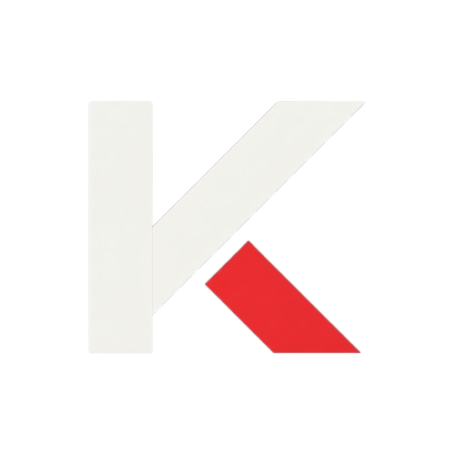

# Kinetic Client

[](https://discord.gg/8VhKD2QQHc)
[](https://codeberg.org/sf6y/Kinetic)
[](https://github.com/cutewaifu303/Kinetic)

<p align="center">
  <a href="https://codeberg.org/sf6y/Kinetic/releases/latest"></a>
</p>

<p align="center"></p>

Kinetic is a Minecraft 1.8.9 hacked client built on Optifine. It is a skid of [Yuri Client](https://github.com/unleg1t/Yuri).

Everything runs locally. Configs are plain JSON files in `Kinetic/` next to the game folder, nothing phones home.

## What is in it

- **Combat**: Aura with seek / swing / attack / block ranges, min/max CPS, Simulate Mouse Clicks (real left clicks), Normal / ML / None rotations with aim point, smart rotation and bruteforce visibility, ray cast and move fix; Auto Block modes Fake, Vanilla, NCP, Hypixel (server-state tracked) and Legit; Velocity, Criticals, Hit Select, Bow Aimbot, Back Track, Auto Pot, Auto Projectile and more.
- **Movement**: Speed, Flight, No Slow, Scaffold (Telly, Hypixel Telly, sprint cancel on yaw mismatch), Timer, Target Strafe and the usual bypasses for Watchdog, Polar and Grim.
- **Visuals**: liquid glass HUD (mod list, keybinds, session, media player), ESP, name tags, animations with block poses, motion blur, shader skies, sound and image renderer, **Kill FX** (shockwaves, light pillar, shards, souls, vortex, rune ring, screen flash and combo kill text in the theme colours) plus the kill impact distortion.
- **Themes**: Marin Kitagawa by default, the Kinetic red, Ichika, Nino, Miku, Yotsuba and Itsuki with character art, Israel and a long list of colour presets.
- **Click GUIs**: Panel (spring animations, tooltips, sliding mode capsules), Kinetic, Classic, ImGui and Novoline, switched in the ClickGUI module.
- **Configs**: local JSON configs, built-in presets and the online configs from [unleg1t/yuri-configs](https://github.com/unleg1t/yuri-configs), converted to Kinetic's property names on download.
- **Alt shop**: Localts, NiceAlts and PandaAlts from the Account Manager, with live purchase progress and automatic login of delivered accounts. Products are sorted by price (cheapest first) and can be searched right in the shop.
- **Launcher**: a small Swing launcher that starts the client with the bundled Java, natives and assets. Other client jars can be launched with the same setup.

## Download and use

1. Get `Kinetic-linux.zip` or `Kinetic-windows.zip` from the [Codeberg releases](https://codeberg.org/sf6y/Kinetic/releases) (the [GitHub mirror](https://github.com/cutewaifu303/Kinetic/releases) has the same files).
2. Extract the zip anywhere and start `Kinetic.jar` (double click or `java -jar Kinetic.jar`). On the first start the launcher downloads Java 8 with JavaFX (Azul Zulu 8 FX) and the Minecraft assets into its data folder (about 250 MB, once). Nothing else has to be installed.
3. Pick RAM and game folder, press Launch. `launch.sh` and `launch.bat` start the game without the launcher once those files exist.
4. In game: right shift opens the ClickGUI, `.help` in chat lists the commands, `.config` saves and loads configs, the Account Manager in the main menu handles cracked, Microsoft, token and cookie logins and the alt shop.

The zip looks like this:

```
Kinetic.jar          the launcher
launch.sh, launch.bat
client/Kinetic.jar   the game
client/natives/      LWJGL natives for your OS
```

The launcher keeps its downloads in `~/.local/share/KineticClient` (Linux), `%LOCALAPPDATA%\KineticClient` (Windows) or `~/Library/Application Support/KineticClient` (macOS). A `Kinetic-<os>-full.zip` with Java and assets already inside can be built with `./gradlew release -Pfull=true`.

On Linux the frame flush ("Low Latency" in the Interface module) is on by default so the game does not feel late at high frame rates; turn it off if you rather have the last few frames per second.

## Build it yourself

You need a JDK 11 (the build compiles against the Java 8 API with `--release 8`, which JDK 8 cannot do) and Git.

```bash
git clone https://codeberg.org/sf6y/Kinetic.git
cd Kinetic
./gradlew shadowJar :launcher:jar
# -> build/libs/Kinetic.jar (client) and launcher/build/libs/Kinetic.jar (launcher)
./gradlew release
# -> dist/Kinetic-linux.zip and dist/Kinetic-windows.zip (add -Pfull=true to bundle Java 8 and the assets)
```

Running `java -jar launcher/build/libs/Kinetic.jar` inside the repository starts the freshly built client with `launch/natives` and `launch/assets`.

In an IDE (IntelliJ recommended): import the Gradle project, create a `run` folder in the project root, add an Application run configuration with main class `Start`, classpath of module `Kinetic.main` and the `run` folder as working directory.

## Contributing

Fork it, branch it, commit it, open a pull request. Keep the module conventions: modules live under `secret.kinetic.modules.impl`, settings are `Property` fields (they are found by reflection), events go through the `EventBus`.

## License

[GNU Affero General Public License v3.0](LICENSE), including the [trademark notice](TRADEMARK.md).

Kinetic is a fork of [Yuri Client](https://github.com/unleg1t/Yuri); the Yuri name and its branding remain with their owner.
